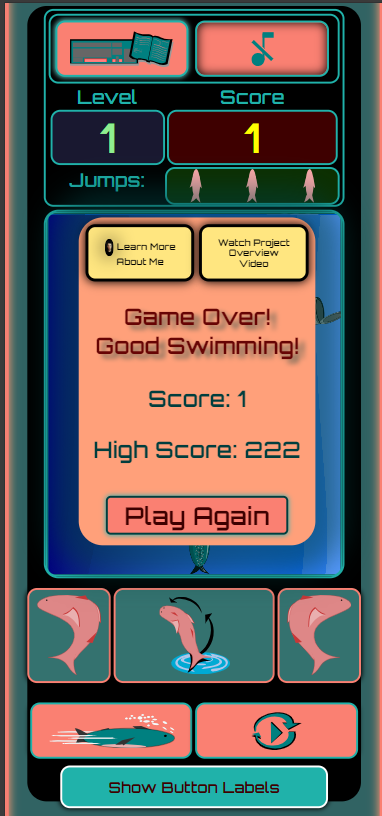

<link rel="stylesheet" type="text/css" href="styles2.css">

<h1>Salmon Flow!</h1>

<h2><a href="https://jayeyem.github.io/Salmon-Flow-Game/">Play the Salmon Flow Game Here!</a></h2>

<h3>Desktop View</h3>

<h3>Mobile View</h3>

<h2>Jump to:</h2>

[About Project](#about)
  [Score & Highscore](#scoreHighscore)
  [Levels](#levels)
  [Speed/Velocity](#speed)
  [Jumping](#jumping)
  [Collision Detection](#collision)
  [Game Over/Restart](#gameOver)
  [Obstacles](#obstacles)  
  [Q & A](#QA)  
[Shout-out](#shoutout)

<h2 id="about">About The Project:</h2>

Salmon Flow is a continuous 2D top-down avoidance game.

I chose to do a game like this, because I was intrigued by games such as flappy bird or tetris. Games that are just downright addicting. I wanted to learn more about how to bring
an idea like that to life. The inspiration for the Salmon Flow theme was drawn from my days of salmon fishing in the summer time with my father. I thought it would be really cool
to take that idea of a salmon's journey up river and put it into the form of a simple yet addicting game to be enjoyed by everyone! I hope it has met that goal in the eyes of anybody
that plays the game.

For best playing experience(in my opinion), desktop/laptop with keyboard is best. However, there is a
mobile layout with touchscreen buttons. You can make the width of your browser window less than the height to view the mobile layout on your computer, but you
will need to be on a touchscreen device for the controls to work. Playing on iPad/tablet makes for a fun little experience. Like wise, if you're on mobile and do not
have acces to a computer, you can turn your device into landscape to see the desktop view of the webpage.

The player controls a salmon with left, right, and jump movements. The goal is to make it as far up river as possible
while dodging obstacles. The salmon can also eat flies along the way to score extra points. Once the max speed is reached, indicated by a
light salmon colored glow around the canvas, jumps are no longer made available -- swimming with extra caution is a must!

If you find yourself unable to survive long enough to reach max speed, you can press "S" key on your keyboard or the Max Speed button on your touchscreen device located
just below the swim left button. This will allow you to view the changes that happen at max speed and start off the round at max, skipping the lower level speeds if
you're looking for a greater challenge.

This game has been created from the ground up using HTML, CSS, and JavaScript.

Game assets and button icons have been made using Inkscape.

In-game music and game over sound were made using https://musiclab.chromeexperiments.com/Song-Maker/.

The font used for headings, score text, level text, etc. is Orbitron, designed by Matt McInerney. The font is found on Google Fonts. I believe the Orbitron font created a
classic game "feel" to the Salmon Flow website and fit well with the overall theme I was trying to achieve.

<h3 id="scoreHighscore">Score & Highscore:</h3>

Each obstacle passed succesfully --> +1 point added to score.
Each time the salmon "eats" flies --> +5 points added to score.

Highscore is saved in local storage currently and does not connect to any leader board. Perhaps that will be a future addition.

<h3 id="levels">Levels:</h3>

Levels are incremented every 10 obstacles that are rendered into the game (starting point along the Y-axis is above canvas height).

<h3 id="speed">Speed/Velocity:</h3>

velocityY is 4 and increments 0.02 each new level up to a maxVelocityY of 30. Salmon velocityX starts at -8 & 8 (left and right). It increments, controlled in
the moveSalmon function, accordingly as the velocityY increases over time.

<h3 id="jumping">Jumping:</h3>
  
  There is a jump function with a call to fall function. During the jump and for 3 seconds after, collisions between salmon and obstacles are not detected.
  Three jumps are initially made available. Once all three are used, it takes 15 seconds for all three to renew. If max speed is reached, no jumps are made 
  available any longer.

<h3 id="collision">Collision Detection:</h3>

Collision detection was a challenge for me, especially since this is my very first project. I realized I didn't take certain things into account when creating the
assets. When the salmon image collided with the obstacle image using a standard collsiion detection formula between two rectangles, it did not visibly look like a
collision due to empty spaces in the image corners. "What did you do to fix the issue?", you ask?...

Well, it is probably up for debate if its a fix. Lets call it a workaround...

There is an ellipse shape overlaying the salmon and each of the obstacles. Then there is a rectangle shape overlaying the salmons length and no wider than the ellipse.
Then there is a small rectangle at the bottom of the obstacle images centered horizontally.

The first collision is detected if the overlaying rectangle of the salmon collides with the overlaying rectangle of the obstacles. This works to detect the collision when
it is a head on collsiion. As well, it detects collisions at certain angles not otherwise detected.

The second collision is between the ellipse that overlays the salmon and the ellipse overlaying each of the obstacles. This works somewhat. I thought I would get away with
just the ellipse collision detection, but after much reading, apparently the collision detection formula for two ellipses colliding is not the most accurate. Thats where
the collision detection between the two overlaying rectangles picks up the slack.

So bascially, the two collision detection formulas act as one to make the collision more visibly accurate to the players' eye. Overriding the issue of the empty spaces in
the corners of the graphics' bounding boxes causing a visibly inaccurate collision detection.

Then finally, the overlaying ellipses and rectangles are all made transparent, of course!

<h3 id="gameOver">Game Over/Restart:</h3>
By the time I got to this stage of the project, I started to realize I should have considered this step sooner. However, I managed to add the functionality and get it working. 
So, on game over, certain actions are performed, and on restart/play again, the necessary variables are reset. During this step, I also tackled the challenge of consolidating all the 
event listeners. I had these spread throughout my code, individual event listeners for every thing. So I managed to consolidate them quite a bit and clean the code up. Though, I am sure it
is probably not the cleanest code you have ever laid eyes on. It took some time, but I managed to get things working again. The touch screen buttons were also added around this time, 
and I had to repeat a similar process as I did for the key board event listeners. When I tried to do the touch screen event listeners in a similar fashion, I could not get the buttons to work.
So they are probably not as consolidated as they could be, but they work, and I am happy with the functionality.

  <h3 id="obstacles">Obstacles:</h3>

I originally started with two obstacle types, beavers and driftwood. The velocityY for beaver is slightly faster than for driftwood. As I overcame the main challenges for the
mechanics of the game, it was suggested by my mentor that it would be a good idea to starting adding more obstacle images. So now, the there is a group of images designated
to the beaver obstacle and its rules, and a group of images designated to the driftwood obstacle and its rules. Everytime an obstacle is rendered into the game now, if it is a
beaver obstacle type, the image displayed is randomly selected from its designated group of images. Likewise for the driftwood obstacle type and its designated image group. So the
images will vary and are not particularly a beaver or driftwood everytime. Depending on which group the image comes from, that will determine the velocity of the obstacle.

<h2 id="QA"> Q & A:</h2>

<h3>"Any more challenges related to the project yet to be tackled?"</h3>
That is a great question, thanks for asking!

1) If a button is pressed and held to move the salmon left or right, and then the player very quickly switches directions, sometimes there is a slight delay in the salmon moving at the full
velocity in the new direction. It doesn't seem to happen too much, and the delay is not for very long, but it is something I would like to look at fixing.
2) A leaderboard. I would like to come back to this project and add a leader board. So people can add their highscores and try beating eachother. The highscore is currently stored in local
storage, only visible to the player on their device. So, perhaps as I become more familiar with the backend of software development, this will be a feature to add!

<h3>"What would you do different?"</h3>
Wow, you are full of great questions!

If I did the project all over again, now that I have a better understanding of JS basics and how the code structuring works, I would plan better. I would also have a better idea of the various
components I need to consider when building the game. So, more careful planning and consideration is what I would do differently, or at least better than the first time around!

<h3>"What's the biggest challenge you faced on a personal level as you made your way through the module one project?"</h3>

Well, there would be two answers to this question:

-> Technical Communication/Comprehension. I knew this would be one of the toughest things for me to overcome, and I am certainly not where I would like to be with this. However, I am hopeful that I
will get better with this as time goes on and I get more coding experience under my belt.

-> Anxiety. In part, related to my downfall in the above, as well as putting myself and my work out there. I am still struggling on this front, but I think I have made great strides in
getting more comfortable with this. So, if you are reading this and face a similar challenge, I suggest that you find your courage and take the first small step to becoming better than you were 
the day before. You might see that great things await you.

<h2 id="shoutout">Shout-out:</h2>

My mentor for this project was Hai Nghiem. He played an important role in helping me to plan accordingly, and to tackle issues one step at a time with the overall goal in mind.
My confidence in my ability to successfully complete this project grew as time went on, and Hai's patience and support was instrumental in that process.

Thank you, Hai!
